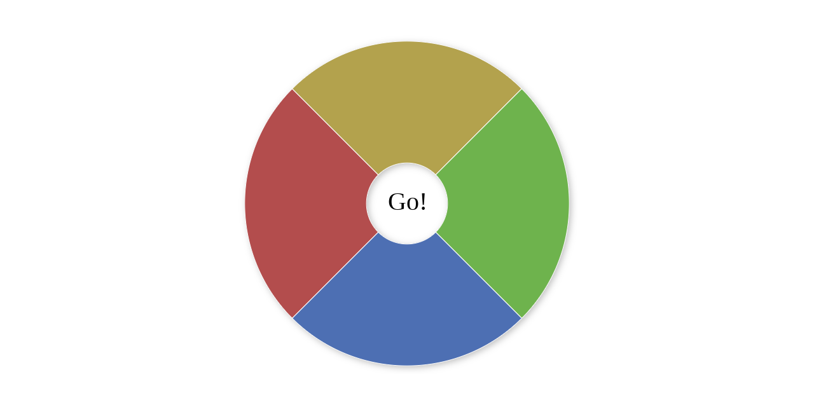

# Genius

A Genius game implemented using JavaScript and [RadialMenu](https://github.com/victorqribeiro/radialMenu)

[Live Version](https://victorribeiro.com/genius)

## About

I've made sure to include all sorts of feedback and visual aids. Some people work better with colors, other with number, other with directions (left, right, up, down), other even with letters (w,a,s,d - I'm looking at you PC players). I hope you find this project fun.
